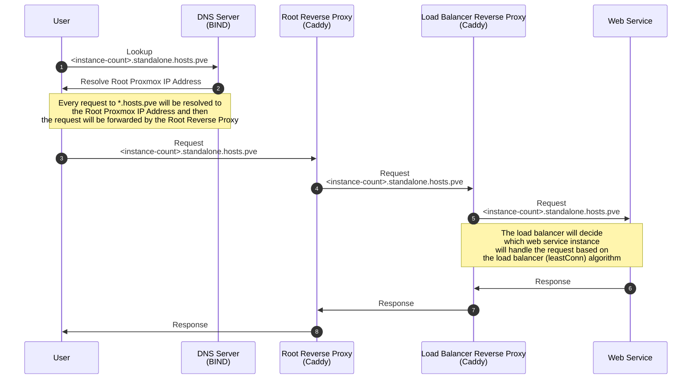
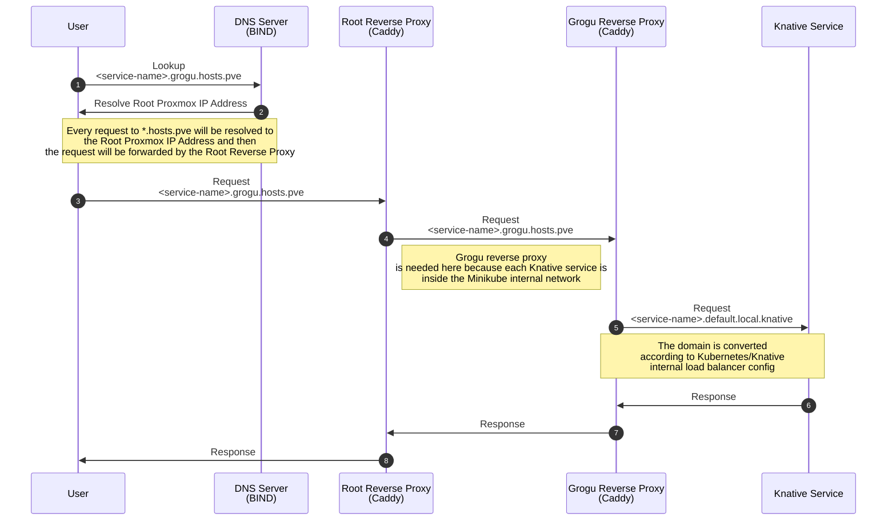

# Proxmox Minikube Knative - Proof of Concept Serverless

This repository is a guide based on my final research project for my degree at Institut Teknologi Sepuluh Nopember. This guide will show you how to deploy [Knative](https://knative.dev/) on [Proxmox](https://www.proxmox.com/en/) using [Minikube](https://minikube.sigs.k8s.io/docs/). There will be also a guide to deploy a conventional system on the same Proxmox server.

> This implementation is just a proof of concept, so it is not recommended to use this guide **AS IS** in production. Use other Kubernetes implementation such as [K3s](https://k3s.io/) or [MicroK8s](https://microk8s.io/) for production.

## Terminologies

- **Serverless System** - A system that uses Knative as the serverless platform, and the system is deployed on the Kubernetes cluster that is hosted on the Proxmox server.
- **Conventional System (Standalone)** - A system that is deployed on the Proxmox server. The system will have 5 web services and 1 load-balancer/reverse-proxy server.

## Technology Used

- [Proxmox](https://www.proxmox.com/en/) (tested on version 7.3-3) - A virtualization platform based on Debian, used to host the Kubernetes cluster and Conventional system.
- [Minikube](https://minikube.sigs.k8s.io/docs/) (tested on version 1.30.1) - A tool that makes it easy to run Kubernetes.
- [Knative](https://knative.dev/) (tested on version 1.10.1) - A Kubernetes-based platform to build, deploy, and manage modern serverless workloads.
- [Docker](https://www.docker.com/) (tested on version 24.0.2) - A set of platform as a service (PaaS) products that use OS-level virtualization to deliver software in packages called containers.
- [Caddy](https://caddyserver.com/) (tested on version 2.6.4) - A powerful, enterprise-ready, open source web server with automatic HTTPS written in Go.
- [BIND](https://www.isc.org/bind/) (tested on version 9.16.15) - The most widely used Domain Name System (DNS) software on the Internet.

## Architecture

### Conventional System


| Description   | CPU | RAM   | Hostname | IP        | User   | Password |
| ------------- | --- | ----- | -------- | --------- | ------ | -------- |
| web-server    | 1   | 512M  | kenobi-1 | 10.0.0.30 | ubuntu | ubuntu   |
| web-server    | 1   | 512M  | kenobi-2 | 10.0.0.31 | ubuntu | ubuntu   |
| web-server    | 1   | 512M  | kenobi-3 | 10.0.0.32 | ubuntu | ubuntu   |
| web-server    | 1   | 512M  | kenobi-4 | 10.0.0.33 | ubuntu | ubuntu   |
| web-server    | 1   | 512M  | kenobi-5 | 10.0.0.34 | ubuntu | ubuntu   |
| load-balancer | 1   | 1024M | kenobi-6 | 10.0.0.35 | ubuntu | ubuntu   |

### Kubernetes Cluster and Knative


| Description | CPU | RAM   | Hostname | IP        | User   | Password |
| ----------- | --- | ----- | -------- | --------- | ------ | -------- |
| knative     | 6   | 8192M | grogu    | 10.0.0.10 | ubuntu | ubuntu   |

### Networking

#### Domain Mapping
| Domain                           | Description                          |
| -------------------------------- | ------------------------------------ |
| \*.hosts.pve                     | Base Domain                          |
| \*.standalone.hosts.pve          | Conventional System Base Domain      |
| one.standalone.hosts.pve         | Conventional System with 1 Instance  |
| two.standalone.hosts.pve         | Conventional System with 2 Instances |
| three.standalone.hosts.pve       | Conventional System with 3 Instances |
| four.standalone.hosts.pve        | Conventional System with 4 Instances |
| five.standalone.hosts.pve        | Conventional System with 5 Instances |
| \*.grogu.hosts.pve               | Serverless System Base Domain        |
| \<service-name\>.grogu.hosts.pve | Knative Services Automatic Domain    |

#### Request Flow of Conventional System



#### Request Flow of Serverless System



## Guide

---

## Proxmox

Assumed that you have installed Proxmox on your machine or have access to a Proxmox server. If you haven't, you can follow the [official guide](https://pve.proxmox.com/wiki/Installation).

### Login to ITS Network (Optional, only if you are using ITS Network)

You can skip this step if you are not using ITS Network.

I've created a script to make it easier to login to ITS Network. You can download the script from [syakhisk/myits-login-script](https://github.com/syakhisk/myits-login-script), you can make the script as a cron job to automatically login to ITS Network.

### Create a new internal network inside Proxmox

You can use the web interface or the CLI to create a new internal network. I'll use the CLI to create a new internal network.

1. Access the Proxmox root shell using SSH or the web shell. So, most of the commands in this guide will be executed on the Proxmox root shell.

2. Append this line to the bottom of `/etc/network/interfaces` file.

```
auto vmbr2
iface vmbr2 inet static
        address  10.0.0.1/24
        bridge-ports none
        bridge-stp off
        bridge-fd 0

        post-up   echo 1 > /proc/sys/net/ipv4/ip_forward
        post-up   iptables -t nat -A POSTROUTING -s '10.0.0.0/24' -o enp1s0 -j MASQUERADE
        post-down iptables -t nat -D POSTROUTING -s '10.0.0.0/24' -o enp1s0 -j MASQUERADE
```

Replace `enp1s0` with your network interface name. You can check your network interface name using `ip a` command.

After modifying the `/etc/network/interfaces` file, you can restart the network service using `systemctl restart networking` command, or you can reboot the Proxmox server.

To check if the network is created, you can use `ip a` command.

```
root@pve:~# ip -br a
lo UNKNOWN 127.0.0.1/8 ::1/128
enp1s0 UP
wlp5s0 DOWN
vmbr0 UP 10.15.40.20/24 fe80::e654:e8ff:fe9b:ec21/64
vmbr2 UP 10.0.0.1/24 fe80::5025:eeff:fecd:ab11/64
```

## Conventional System

### Create Base VM

1. Access the Proxmox root shell using SSH or the web shell. So, most of the commands in this guide will be executed on the Proxmox root shell.

2. Download Ubuntu Server 20.04 LTS Cloud Image from [Ubuntu Cloud Images](https://cloud-images.ubuntu.com/jammy/current/)

```bash
curl -o jammy-server.img https://cloud-images.ubuntu.com/jammy/20230405/jammy-server-cloudimg-amd64.img
```

3. Modifying the image

By default, this image have 2GB of disk size. We'll resize it to 10GB. We'll need the `qemu-img`, if you don't have it, you can install it.

```bash
sudo apt update -y
sudo apt install -y libguestfs-tools
sudo apt install -y qemu-utils
```

To check the image info using `qemu-img` command.

```bash
qemu-img info jammy-server.img
```

```
root@pve:~# qemu-img info jammy-server.img
image: jammy-server.img
file format: qcow2
virtual size: 2.2 GiB (2361393152 bytes)
disk size: 653 MiB
cluster_size: 65536
Format specific information:
compat: 0.10
compression type: zlib
refcount bits: 16
```

To resize the image, we'll use the `qemu-img resize` command.

```bash
cp jammy-server.img resized-jammy-server.img
qemu-img resize resized-jammy-server.img 10G
qemu-img info resized-jammy-server.img
```

```
root@pve:~# qemu-img info resized-jammy-server.img
image: resized-jammy-server.img
file format: qcow2
virtual size: 10 GiB (10737418240 bytes)
disk size: 653 MiB
cluster_size: 65536
Format specific information:
compat: 0.10
compression type: zlib
refcount bits: 16
```

The image is now resized to 10GB. Now, we'll continue to create a new VM template.

3. Create a new VM on Proxmox

We'll use the `qm` command to create a new VM template. I've created a script to make it easier to create a new VM. You can use the script from [here](./scripts/create-standalone-template.sh).

> `qm` command is a Proxmox command to manage VMs. You can read the documentation [here](https://pve.proxmox.com/pve-docs/qm.1.html).

```bash
#!/bin/env bash

VM_ID="8000"
NAME="template-standalone"
IMAGE="/root/images/resized-jammy-server.img"

IP="10.0.0.30/22"
GW="10.0.0.1"

USERNAME="ubuntu"
PASSWORD="ubuntu"
SSH_KEY="$HOME/.ssh/id_rsa.pub"

MEMORY="512"
CORES="1"

qm create "$VM_ID" \
  --name "$NAME" \
  --memory "$MEMORY" \
  --cores "$CORES" \
  --net0 virtio,bridge=vmbr2 \
  --scsihw virtio-scsi-pci \
  --scsi0 local-lvm:0,import-from="$IMAGE" \
  --ide2 local-lvm:cloudinit \
  --boot order=scsi0 \
  --serial0 socket --vga serial0 \
  --ipconfig0 ip="$IP",gw="$GW" \
  --sshkey "$SSH_KEY" \
  --ciuser "$USERNAME" --cipassword="$(openssl passwd -6 "$PASSWORD")"
```

Make sure the Proxmox root node have an SSH key. You can generate a new SSH key using `ssh-keygen` command.

```bash
ssh-keygen -t rsa -b 4096
```

You can modify the script to suit your needs. After modifying the script, you can execute the script using `bash create-standalone-template.sh` command.

4. Install Dependencies on the VM

After the VM is created, you can start the VM using `qm start 8000` command. You can access the VM using `qm terminal 8000` or SSH.

```bash
qm terminal 8000

# or

ssh ubuntu@10.0.0.35
```

After accessing the VM, you can install the dependencies using the following commands.

To install git, make, and curl, you can use the following commands.

```bash
sudo apt update -y
sudo apt install -y git make curl
```

To install Docker, you can use the following commands.

```bash
curl -fsSL https://get.docker.com | sudo bash

# Docker postinstall
sudo groupadd docker
sudo usermod -aG docker $USER
newgrp docker

# Test Docker
docker run hello-world
```

You can also add more stuff to the VM and all of the changes will be there when you convert the VM to a template.

### Converting Base VM to Template

To convert the VM to a template, you can use `qm template` command. Make sure the VM is stopped before converting it to a template.

```bash
# Shutdown the VM
qm shutdown 8000

# Use the vm ID that you've created before, e.g. 8000
qm template 8000
```

### Create VM Instances

1. Create a new Web Service VM Instance from the template

To create a new VM from the template, you can use `qm clone` command. Use the `qm set` command to modify the VM configuration.

```bash
# Do a 'linked-clone' and specify the new VM ID and name
qm clone 8000 800 --name kenobi-1

# Modify the VM IP address and gateway
qm set 800 --ipconfig0 ip=10.0.0.30/24,gw=10.0.0.1
```

Repeat the steps above to create 5 VM from the template, you can refer to the [Conventional System Architecture](#conventional-system) table.

To check if the VM is created, you can use `qm list` command.

```bash
qm list
```

2. Create a new Load Balancer VM Instance from the template

We can use the same template to create the load-balancer instance, but we need to adjust the RAM size. We'll use 1GB of RAM for the load-balancer instance.

```bash
# Do a 'linked-clone' and specify the new VM ID and name
qm clone 8000 805 --name kenobi-6

# Modify the VM IP address and gateway
qm set 805 --ipconfig0 ip=10.0.0.35/24,gw=10.0.0.1

# Modify the VM RAM size
qm set 805 --memory 1024
```

To check if the VM is created, you can use `qm list` command.

```bash
qm list
```

### Running the Web Service
