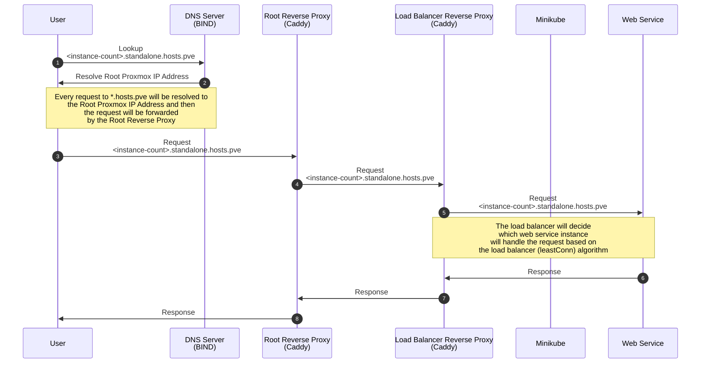
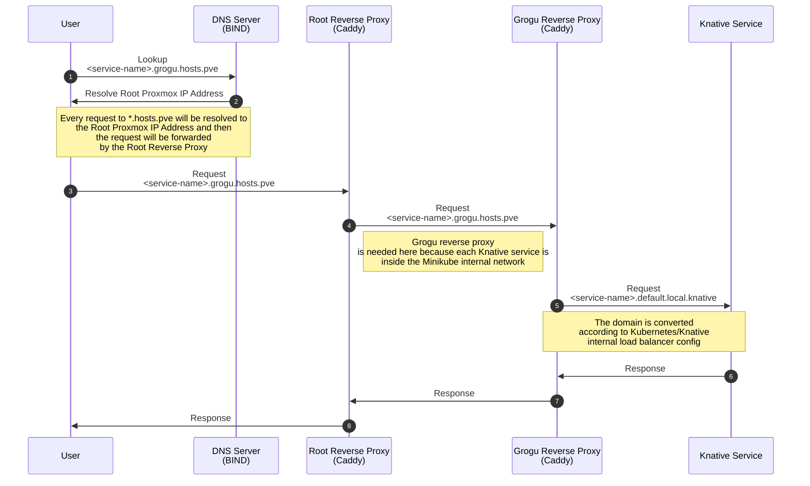

# Proxmox Minikube Knative - Serverless Proof of Concept

This repository is a guide based on my final research project for my degree at Institut Teknologi Sepuluh Nopember. This guide will show you how to deploy [Knative](https://knative.dev/) on [Proxmox](https://www.proxmox.com/en/) using [Minikube](https://minikube.sigs.k8s.io/docs/). There will be also a guide to deploy a conventional system on the same Proxmox server.

> This implementation is just a proof of concept, so it is not recommended to use this guide **AS IS** in production. Use other Kubernetes implementation such as [K3s](https://k3s.io/) or [MicroK8s](https://microk8s.io/) for production instead of Minikube.

Since there are some detailed images and charts you can access the Readme file directly so that the images and charts are rendered larger [here](./README.md)

## Terminologies

### **Serverless System**
A system that uses Knative as the serverless platform, and the system is deployed on the Kubernetes cluster (Minikube) that is inside a single VM instance.

### **Conventional System (Standalone)**
A system that is deployed on the Proxmox server. The system will have 5 web services and 1 load-balancer/reverse-proxy server, each hosted on a single VM instance.

## Technology Used

- [Proxmox](https://www.proxmox.com/en/) (tested on version 7.3-3) - A virtualization platform based on Debian, used to host the Kubernetes cluster and Conventional system.
- [Minikube](https://minikube.sigs.k8s.io/docs/) (tested on version 1.30.1) - A tool that makes it easy to run Kubernetes.
- [Knative](https://knative.dev/) (tested on version 1.10.1) - A Kubernetes-based platform to build, deploy, and manage modern serverless workloads.
- [Docker](https://www.docker.com/) (tested on version 24.0.2) - A set of platform as a service (PaaS) products that use OS-level virtualization to deliver software in packages called containers.
- [Caddy](https://caddyserver.com/) (tested on version 2.6.4) - A powerful, enterprise-ready, open source web server with automatic HTTPS written in Go.
- [BIND](https://www.isc.org/bind/) (tested on version 9.16.15) - The most widely used Domain Name System (DNS) software on the Internet.

## Architecture

### Conventional System


| Description   | CPU | RAM   | Hostname | IP        | User   | Password |
| ------------- | --- | ----- | -------- | --------- | ------ | -------- |
| web-server    | 1   | 512M  | kenobi-1 | 10.0.0.30 | ubuntu | ubuntu   |
| web-server    | 1   | 512M  | kenobi-2 | 10.0.0.31 | ubuntu | ubuntu   |
| web-server    | 1   | 512M  | kenobi-3 | 10.0.0.32 | ubuntu | ubuntu   |
| web-server    | 1   | 512M  | kenobi-4 | 10.0.0.33 | ubuntu | ubuntu   |
| web-server    | 1   | 512M  | kenobi-5 | 10.0.0.34 | ubuntu | ubuntu   |
| load-balancer | 1   | 1024M | kenobi-6 | 10.0.0.35 | ubuntu | ubuntu   |

### Kubernetes Cluster and Knative


| Description | CPU | RAM   | Hostname | IP        | User   | Password |
| ----------- | --- | ----- | -------- | --------- | ------ | -------- |
| knative     | 6   | 8192M | grogu    | 10.0.0.10 | ubuntu | ubuntu   |

### Networking

#### Domain Mapping
| Domain                           | Description                          |
| -------------------------------- | ------------------------------------ |
| \*.hosts.pve                     | Base Domain                          |
| \*.standalone.hosts.pve          | Conventional System Base Domain      |
| one.standalone.hosts.pve         | Conventional System with 1 Instance  |
| two.standalone.hosts.pve         | Conventional System with 2 Instances |
| three.standalone.hosts.pve       | Conventional System with 3 Instances |
| four.standalone.hosts.pve        | Conventional System with 4 Instances |
| five.standalone.hosts.pve        | Conventional System with 5 Instances |
| \*.grogu.hosts.pve               | Serverless System Base Domain        |
| \<service-name\>.grogu.hosts.pve | Knative Services Automatic Domain    |

#### Request Flow of Conventional System



#### Request Flow of Serverless System



## Implementation Guide

## Proxmox

Assumed that you have installed Proxmox on your machine or have access to a Proxmox server. If you haven't, you can follow the [official guide](https://pve.proxmox.com/wiki/Installation).

### Login to ITS Network (Optional, only if you are using ITS Network)

You can skip this step if you are not using ITS Network.

I've created a script to make it easier to login to ITS Network. You can download the script from [syakhisk/myits-login-script](https://github.com/syakhisk/myits-login-script), you can make the script as a cron job to automatically login to ITS Network.

### Create a new internal network inside Proxmox

You can use the web interface or the CLI to create a new internal network. I'll use the CLI to create a new internal network.

1. Access the Proxmox root shell using SSH or the web shell. So, most of the commands in this guide will be executed on the Proxmox root shell.

2. Append this line to the bottom of `/etc/network/interfaces` file.

```
auto vmbr2
iface vmbr2 inet static
        address  10.0.0.1/24
        bridge-ports none
        bridge-stp off
        bridge-fd 0

        post-up   echo 1 > /proc/sys/net/ipv4/ip_forward
        post-up   iptables -t nat -A POSTROUTING -s '10.0.0.0/24' -o enp1s0 -j MASQUERADE
        post-down iptables -t nat -D POSTROUTING -s '10.0.0.0/24' -o enp1s0 -j MASQUERADE
```

Replace `enp1s0` with your network interface name. You can check your network interface name using `ip a` command.

After modifying the `/etc/network/interfaces` file, you can restart the network service using `systemctl restart networking` command, or you can reboot the Proxmox server.

To check if the network is created, you can use `ip a` command.

```
root@pve:~# ip -br a
lo UNKNOWN 127.0.0.1/8 ::1/128
enp1s0 UP
wlp5s0 DOWN
vmbr0 UP 10.15.40.20/24 fe80::e654:e8ff:fe9b:ec21/64
vmbr2 UP 10.0.0.1/24 fe80::5025:eeff:fecd:ab11/64
```

### Run the Root Reverse Proxy & DNS Server

The root reverse proxy and DNS server is needed to route and resolve the request to the correct destination.

To simplify the process, I used Docker Compose to run these services. The docker compose file is available [here](./networking/proxmox/docker-compose.yml).

First we need to install Docker in the root proxmox node, to do that we can use the docker install script

```bash
curl -fsSL https://get.docker.com | sudo bash
```

Check the Docker installation using `docker run hello-world` command.

```bash
docker run hello-world
```

After Docker is installed, we can start the Docker Compose service.

```bash
cd networking/proxmox
docker-compose up -d
```

## Conventional System

### Create Base VM

1. Access the Proxmox root shell using SSH or the web shell. So, most of the commands in this guide will be executed on the Proxmox root shell.

2. Download Ubuntu Server 20.04 LTS Cloud Image from [Ubuntu Cloud Images](https://cloud-images.ubuntu.com/jammy/current/)

```bash
curl -o jammy-server.img https://cloud-images.ubuntu.com/jammy/20230405/jammy-server-cloudimg-amd64.img
```

3. Modifying the image

By default, this image have 2GB of disk size. We'll resize it to 10GB. We'll need the `qemu-img`, if you don't have it, you can install it.

```bash
sudo apt update -y
sudo apt install -y libguestfs-tools
sudo apt install -y qemu-utils
```

To check the image info using `qemu-img` command.

```bash
qemu-img info jammy-server.img
```

```
root@pve:~# qemu-img info jammy-server.img
image: jammy-server.img
file format: qcow2
virtual size: 2.2 GiB (2361393152 bytes)
disk size: 653 MiB
cluster_size: 65536
Format specific information:
compat: 0.10
compression type: zlib
refcount bits: 16
```

To resize the image, we'll use the `qemu-img resize` command.

```bash
cp jammy-server.img resized-jammy-server.img
qemu-img resize resized-jammy-server.img 10G
qemu-img info resized-jammy-server.img
```

```
root@pve:~# qemu-img info resized-jammy-server.img
image: resized-jammy-server.img
file format: qcow2
virtual size: 10 GiB (10737418240 bytes)
disk size: 653 MiB
cluster_size: 65536
Format specific information:
compat: 0.10
compression type: zlib
refcount bits: 16
```

The image is now resized to 10GB. Now, we'll continue to create a new VM template.

3. Create a new VM on Proxmox

We'll use the `qm` command to create a new VM template. I've created a script to make it easier to create a new VM. You can use the script from [./scripts/create-standalone-template.sh](./scripts/create-standalone-template.sh).

> `qm` command is a Proxmox command to manage VMs. You can read the documentation [here](https://pve.proxmox.com/pve-docs/qm.1.html).

```bash
#!/bin/env bash

VM_ID="8000"
NAME="template-standalone"
IMAGE="/root/images/resized-jammy-server.img"

IP="10.0.0.30/22"
GW="10.0.0.1"

USERNAME="ubuntu"
PASSWORD="ubuntu"
SSH_KEY="$HOME/.ssh/id_rsa.pub"

MEMORY="512"
CORES="1"

qm create "$VM_ID" \
  --name "$NAME" \
  --memory "$MEMORY" \
  --cores "$CORES" \
  --net0 virtio,bridge=vmbr2 \
  --scsihw virtio-scsi-pci \
  --scsi0 local-lvm:0,import-from="$IMAGE" \
  --ide2 local-lvm:cloudinit \
  --boot order=scsi0 \
  --serial0 socket --vga serial0 \
  --ipconfig0 ip="$IP",gw="$GW" \
  --sshkey "$SSH_KEY" \
  --ciuser "$USERNAME" --cipassword="$(openssl passwd -6 "$PASSWORD")"
```

Make sure the Proxmox root node have an SSH key. You can generate a new SSH key using `ssh-keygen` command.

```bash
ssh-keygen -t rsa -b 4096
```

You can modify the script to suit your needs. After modifying the script, you can execute the script using `bash create-standalone-template.sh` command.

4. Install Dependencies on the VM

After the VM is created, you can start the VM using `qm start 8000` command. You can access the VM using `qm terminal 8000` or SSH.

```bash
qm terminal 8000

# or

ssh ubuntu@10.0.0.30
```

After accessing the VM, you can install the dependencies using the following commands.

To install git, make, and curl, you can use the following commands.

```bash
sudo apt update -y
sudo apt install -y git make curl
```

To install Docker, you can use the following commands.

```bash
curl -fsSL https://get.docker.com | sudo bash

# Docker postinstall
sudo groupadd docker
sudo usermod -aG docker $USER
newgrp docker

# Test Docker
docker run hello-world
```

You can also add more stuff to the VM and all of the changes will be there when you convert the VM to a template.

### Converting Base VM to Template

To convert the VM to a template, you can use `qm template` command. Make sure the VM is stopped before converting it to a template.

```bash
# Shutdown the VM
qm shutdown 8000

# Use the vm ID that you've created before, e.g. 8000
qm template 8000
```

### Create VM Instances

1. Create a new Web Service VM Instance from the template

To create a new VM from the template, you can use `qm clone` command. Use the `qm set` command to modify the VM configuration.

```bash
# Do a 'linked-clone' and specify the new VM ID and name
qm clone 8000 800 --name kenobi-1

# Modify the VM IP address and gateway
qm set 800 --ipconfig0 ip=10.0.0.30/24,gw=10.0.0.1
```

Repeat the steps above to create 5 VM from the template, you can refer to the [Conventional System Architecture](#conventional-system) table.

To check if the VM is created, you can use `qm list` command.

```bash
qm list
```

2. Create a new Load Balancer VM Instance from the template

We can use the same template to create the load-balancer instance, but we need to adjust the RAM size. We'll use 1GB of RAM for the load-balancer instance.

```bash
# Do a 'linked-clone' and specify the new VM ID and name
qm clone 8000 805 --name kenobi-6

# Modify the VM IP address and gateway
qm set 805 --ipconfig0 ip=10.0.0.35/24,gw=10.0.0.1

# Modify the VM RAM size
qm set 805 --memory 1024
```

To check if the VM is created, you can use `qm list` command.

```bash
qm list
```

3. Start the VM Instances

To start the VM, you can use `qm start` command.

```bash
qm start 800
qm start 801
...
qm start 805
```

Wait until all of the VM instances are started, the first boot will take some time because the cloud-init will run and install the dependencies.

You can monitor the progress using `qm terminal` command or using the Proxmox web shell.

```bash
qm terminal 800
```

### Running the Web Service

The web service is a simple (naive) fibonacci calculator, you can check the source code [here](./web-service).

Assuming you have this repository cloned in each instance, you can run the web service using these steps.

Access each VM instance using `qm terminal` or SSH, I will use SSH in this step and will only show the commands for the first instance. You can repeat the steps below for the other instances.

```bash
ssh ubuntu@10.0.0.30
# Go inside the web-service directory in this repository
cd web-service

# Build the Docker image using the Makefile
make build
```

> A Docker image will be built with the tag `dev.local/fibonacci:1.0.0`

To run a container, you can use the Docker Compose file (docker compose is used so that the container is automatically started between VM restarts). The docker compose file is available [here](./web-service/docker-compose.yml).

```bash
# inside the web-service directory
docker-compose up -d
```

> The application inside the container will be started in port 3000, you can access the app using `curl localhost:3000` command.


### Running the Load Balancer

The load balancer is a reverse proxy server that will forward the request to the web service instances. We'll use Caddy as the reverse proxy server.

Access the Load Balancer VM instance, I will use SSH in this step.

```bash
ssh ubuntu@10.0.0.35
cd networking/load-balancer
docker compose up -d
```

> To check if the load balancer is working, you can access the load balancer using `curl -H "Host: test.standalone.hosts.pve" localhost` command.

## Serverless System

### Create Base VM

Most of the steps are the same as the [Conventional System](#create-base-vm) steps, but we'll use a different VM configuration.

1. Access the Proxmox root shell using SSH or the web shell.

2. Create a new VM on Proxmox
We'll use the `qm` command to create a new VM template. I've created a script to make it easier to create a new VM. You can use the script from [./scripts/create-knative-template.sh](./scripts/create-knative-template.sh).

```bash
#!/bin/env bash

VM_ID="9000"
NAME="template-knative"
IMAGE="/root/images/resized-jammy-server.img"

IP="10.0.0.10/22"
GW="10.0.0.1"

USERNAME="ubuntu"
PASSWORD="ubuntu"
SSH_KEY="$HOME/.ssh/id_rsa.pub"

MEMORY="4096"
CORES="6"

qm create "$VM_ID" \
  --name "$NAME" \
  --memory "$MEMORY" \
  --cores "$CORES" \
  --net0 virtio,bridge=vmbr2 \
  --scsihw virtio-scsi-pci \
  --scsi0 local-lvm:0,import-from="$IMAGE" \
  --ide2 local-lvm:cloudinit \
  --boot order=scsi0 \
  --serial0 socket --vga serial0 \
  --ipconfig0 ip="$IP",gw="$GW" \
  --sshkey "$SSH_KEY" \
  --ciuser "$USERNAME" --cipassword="$(openssl passwd -6 "$PASSWORD")"
```

You can modify the script to suit your needs. After modifying the script, you can execute the script using `bash create-knative-template.sh` command.

3. Install Dependencies on the VM

After the VM is created, you can start the VM using `qm start 9000` command. You can access the VM using `qm terminal 9000` or SSH.

```bash
qm terminal 9000

# or

ssh ubuntu@10.0.0.10
```

After accessing the VM, you can install the dependencies using the following commands.

To install git, make, and curl, you can use the following commands.

```bash
sudo apt update -y
sudo apt install -y git make curl
```

To install Docker, you can use the following commands.

```bash
curl -fsSL https://get.docker.com | sudo bash

# Docker postinstall
sudo groupadd docker
sudo usermod -aG docker $USER
newgrp docker

# Test Docker
docker run hello-world
```

### Converting Base VM to Template

To convert the VM to a template, you can use `qm template` command. Make sure the VM is stopped before converting it to a template.

```bash
# Shutdown the VM
qm shutdown 9000

# Use the vm ID that you've created before, e.g. 9000
qm template 9000
```

### Create VM Instances

To create a new VM from the template, you can use `qm clone` command. Use the `qm set` command to modify the VM configuration.

```bash
# Do a 'linked-clone' and specify the new VM ID and name
qm clone 9000 600 --name grogu

# Modify the VM IP address and gateway
qm set 600 --ipconfig0 ip=10.0.0.30/24,gw=10.0.0.1
```

To check if the VM is created, you can use `qm list` command.

```bash
qm list
```

To start the VM, you can use `qm start` command.

```bash
qm start 600
```

Wait until the VM instance are started, the first boot will take some time because the cloud-init will run and install the dependencies.

### Minikube Setup

Access the VM instance using `qm terminal` or SSH, I will use SSH in this step.

```bash
ssh ubuntu@10.0.0.10
```

1. Installing Minikube

To install Minikube, you can use the follow the [official guide](https://minikube.sigs.k8s.io/docs/start/). I will show the commands that I used to install Minikube here.

```bash
curl -LO https://storage.googleapis.com/minikube/releases/latest/minikube-linux-amd64
sudo install minikube-linux-amd64 /usr/local/bin/minikube
```

> This command will install the latest version of Minikube. You can check the Minikube version using `minikube version` command.

2. Setting up completion and alias (optional)

```bash
mkdir -p ~/.local/bin
cat >> ~/.bashrc << EOF
export PATH="$PATH:$HOME/.local/bin"
[[ ! -f $HOME/.local/bin/kubectl ]] && ln -s $(which minikube) ~/.local/bin/kubectl
source <(minikube completion bash)
source <(kubectl completion bash)
alias k="kubectl"
complete -o default -F __start_kubectl k
EOF

exec bash
```

3. Starting Minikube

We'll start Minikube using the `minikube start` command. We'll use all the CPU and RAM available on the VM.

```bash
minikube start --cpus=max --memory=max
```

> This command will start Minikube with 6 CPUs and 8GB of RAM.

You can enable the `dashboard` addon to access the Kubernetes Dashboard.
You can also enable the `metric-server` addon to monitor the CPU and RAM usage from the Kubernetes Dashboard.

```bash
minikube addons enable dashboard
minikube addons enable metrics-server
```

4. Checking Minikube installation

To check if Minikube is installed correctly, you can use `kubectl` command.

```bash
kubectl get nodes

# or

kubectl get pods --all-namespaces
```

### Knative Serving Setup

In this guide I used Knative v1.10.1, if you want to use a different version, you can check the [official guide](https://knative.dev/docs/install/yaml-install/serving/install-serving-with-yaml)


1. Installing Knative custom resource definitions (CRDs)

```bash
kubectl apply -f https://github.com/knative/serving/releases/download/knative-v1.10.1/serving-crds.yaml
```

2. Installing Knative core components

```bash
kubectl apply -f https://github.com/knative/serving/releases/download/knative-v1.10.1/serving-core.yaml
```

3. Installing Kourier as the networking layer (ingress)

```bash
kubectl apply -f https://github.com/knative/net-kourier/releases/download/knative-v1.10.0/kourier.yaml
```

4. Configuring Knative to use Kourier

```bash
kubectl patch configmap/config-network \
  --namespace knative-serving \
  --type merge \
  --patch '{"data":{"ingress-class":"kourier.ingress.networking.knative.dev"}}'
```

5. Checking Kourier installation

```bash
kubectl --namespace kourier-system get svc kourier
```

the output should look like this.

```
ubuntu@grogu:~$ kubectl --namespace kourier-system get svc kourier
NAME      TYPE           CLUSTER-IP      EXTERNAL-IP   PORT(S)                      AGE
kourier   LoadBalancer   10.102.11.179   <pending>     80:32518/TCP,443:30341/TCP   27s
```

6. Installing the Kubernetes Horizontal Pod Autoscaler (HPA) controller

```bash
kubectl apply -f https://github.com/knative/serving/releases/download/knative-v1.10.1/serving-hpa.yaml
```

7. Checking Knative installation

```bash
kubectl get pods --namespace knative-serving
```

the output should look like this.

```
ubuntu@grogu:~$ kubectl get pods --namespace knative-serving
NAME                                      READY   STATUS    RESTARTS   AGE
activator-554cbc944b-wbqkz                1/1     Running   0          93s
autoscaler-6874cff868-8mtkd               1/1     Running   0          93s
controller-55865bbc7c-7999r               1/1     Running   0          93s
domain-mapping-9dc9b7468-l8gtq            1/1     Running   0          92s
domainmapping-webhook-56579bf69d-zxf9b    1/1     Running   0          92s
net-kourier-controller-5fcbb6d996-5fx9t   1/1     Running   0          47s
webhook-5c9568b4f7-nsm7s                  1/1     Running   0          91s
```

> You need to wait until all of the pods are in `Running` state.

8. Change the default domain to `local.knative`

```bash
kubectl patch configmap/config-domain \
  --namespace knative-serving \
  --type merge \
  --patch '{"data":{"local.knative":""}}'
```

9. Deploying Sample Application

Create a `helloworld-go.yaml` file with the following content.

```yaml
apiVersion: serving.knative.dev/v1
kind: Service
metadata:
  name: helloworld-go
  namespace: default
spec:
  template:
    spec:
      containers:
        - image: ghcr.io/knative/helloworld-go:latest
          ports:
            - containerPort: 8080
          env:
            - name: TARGET
              value: "World"
```

This will deploy a sample application from [knative/helloworld-go](https://github.com/knative/docs/tree/main/code-samples/serving/hello-world/helloworld-go)

To deploy the sample application, you can use `kubectl apply` command.

```bash
kubectl apply -f helloworld-go.yaml
```

To check if the application is deployed, you can use `kubectl get` command.

```bash
kubectl get ksvc helloworld-go
```

the output should look like this.

```
ubuntu@grogu:~$ kubectl get ksvc helloworld-go
NAME            URL                                         LATESTCREATED   LATESTREADY   READY   REASON
helloworld-go   http://helloworld-go.default.local.knative   helloworld-go   helloworld-go   True
```

To access the application, you can use `curl` command. However, you need to use the `Host` header to access the application to the Minikube internal network.

```bash
MINIKUBE_IP=$(minikube ip)
KOURIER_PORT=$(kubectl get svc kourier --namespace kourier-system --output 'jsonpath={.spec.ports[?(@.port==80)].nodePort}')

curl -H "Host: helloworld-go.default.local.knative" http://$MINIKUBE_IP:$KOURIER_PORT
```

the output should look like this.

```
Hello World!
```

After confirming that the application is working, you can delete the sample application using `kubectl delete` command.

```bash
kubectl delete -f helloworld-go.yaml
```

### Deploying the Knative Service

The web service is a simple (naive) fibonacci calculator, you can check the source code [./web-service](./web-service).

Since we don't have the Docker Image pushed to the registry, we'll build the Docker Image and Load it to the Minikube installation using `minikube load` command.

We need to build the Docker Image on the VM instance (grogu) and load it to Minikube, Assuming you have this repository cloned in the VM instance, you can run these commands.

```bash
# inside grogu VM
cd web-service
make build
make load
```

> A Docker image will be built with the tag `dev.local/fibonacci:1.0.0` and loaded to Minikube.

To check if the Docker Image is loaded to Minikube, you can use `minikube image list` command.

```bash
minikube image list
```

the output should look like this.

```
ubuntu@grogu:~$ minikube image list
REPOSITORY                  TAG       DIGEST       IMAGE ID       CREATED       SIZE
dev.local/fibonacci         1.0.0     XX  XX   2 hours ago   XX
```

I have created multiple Knative services, you can check the YAML files [./web-services/services](./web-services/services).

In this guide, I will use the `behavior.yaml` file. This file will create a Knative service with 5 replicas and will scale down to 1 replica if there is no request for 30 seconds.

> For more information about Knative Serving Autoscaling, you can check the [official documentation](https://knative.dev/docs/serving/autoscaling/)

To deploy the Knative service, you can use `kubectl apply` command.

```bash
cd services
kubectl apply -f behavior.yaml
```

This will create a Knative service with the name `fibonacci-behavior` and will be accessible from `fibonacci-behavior.default.local.knative` domain.

To check if the application is deployed, you can use `kubectl get` command.

```bash
kubectl get ksvc fibonacci-behavior
```

To check the pods, you can use `kubectl get` command.

```bash
kubectl get pods
```

the output should look like this.

```
ubuntu@grogu:~$ kubectl get pods
NAME                                              READY   STATUS    RESTARTS   AGE
fibonacci-behavior-00001-deployment-5c8d9b9b5-4q9qg   2/2     Running   0          2m
```

To access the application, you can use `curl` command. However, you need to use the `Host` header to access the application to the Minikube internal network.

```bash
MINIKUBE_IP=$(minikube ip)
KOURIER_PORT=$(kubectl get svc kourier --namespace kourier-system --output 'jsonpath={.spec.ports[?(@.port==80)].nodePort}')

curl -H "Host: fibonacci-behavior.default.local.knative" http://$MINIKUBE_IP:$KOURIER_PORT
```

The output should be like.

```
{"result":832040}
```

### Setting Up the Load Balancer on Grogu

To expose the Knative Service to the network, we'll use a Reverse Proxy Server to route the request to Minikube.

We'll use Caddy as the reverse proxy server. The Caddy configuration file is available [here](./networking/knative/Caddyfile). We also need the Minikube IP address and the Kourier port to configure the Caddyfile. I've created the [env](./networking/knative/env) file to store the Minikube IP address and the Kourier port.

To load the environment variables, you can use `source` command.

```bash
cd networking/knative
source ./env
```

To check the environment variables, you can use the `echo` command.

```bash
echo $MINIKUBE_IP
echo $KOURIER_PORT
```

If the environment variables are loaded correctly, you can start the Caddy service using `docker compose` command.

```bash
docker compose up -d
```

> To check if the load balancer is working, you can access the load balancer using `curl -H "Host: fibonacci-behavior.grogu.hosts.pve" localhost` command.

The Reverse Proxy will replace the domain from `fibonacci-behavior.grogu.hosts.pve` to `fibonacci-behavior.default.local.knative` and forward the request to Minikube internal network.

### Setting Up Kubernetes Dashboard

Minikube have a built-in Kubernetes Dashboard, you can access the dashboard using `minikube dashboard` command. But since we are running in a VM and don't have a GUI, we'll use the Reverse Proxy to access the dashboard.

First, we need to expose the Kubernetes Dashboard to the network. To do that, we'll convert the Kubernetes Dashboard service to a NodePort service.

```bash
kubectl patch service kubernetes-dashboard -n kubernetes-dashboard --type='json' -p='[{"op": "replace", "path": "/spec/type", "value": "NodePort"}, {"op": "add", "path": "/spec/ports/0/nodePort", "value": 30000}]'
```

This will convert the Kubernetes Dashboard service to a NodePort service and expose the service to port 30000.

You can check the service using `kubectl get` command.

```bash
kubectl get service kubernetes-dashboard -n kubernetes-dashboard
```

the output should look like this.

```
ubuntu@grogu:~$ kubectl get service kubernetes-dashboard -n kubernetes-dashboard
NAME                   TYPE       CLUSTER-IP      EXTERNAL-IP   PORT(S)         AGE
kubernetes-dashboard   NodePort   xxx             <none>        443:30000/TCP   2d
```

The Reverse Proxy configuration for the dashboard is already set up in the [Caddyfile](./networking/knative/Caddyfile). You can access the dashboard using `curl -H "Host: dashboard.grogu.hosts.pve" localhost` command.

## Setting Up Local Computer to Access the System (Optional)

The system is already accessible from the Proxmox root node, but if you want to access the system from your local computer, you'll need to:

1. Have access to the Proxmox root node (In my implementation, it would be the ITS network. The local computer will be connected to the ITS network)
2. Added the Proxmox root node IP address as a DNS server on your local computer

### Adding the Proxmox root node IP address as a DNS server on your local computer

If you're using Linux, you can add the Proxmox root node IP address as a DNS server on your local computer using the following steps.

1. Open the `/etc/resolv.conf` file using your favorite text editor.

```bash
sudo vim /etc/resolv.conf
```

2. Add the Proxmox root node IP address as a DNS server.

```
nameserver 10.15.40.20 # proxmox root ip address
...
```

3. Save the file and exit.

### Accessing the System

After adding the Proxmox root node IP address as a DNS server, you can access the services using the domain. You can do that via the browser or using the `curl` command.

> Since we don't have a valid SSL certificate, you need to add the `-k` flag to the `curl` command. Opening the domain via the browser will show a warning, you can ignore the warning and continue to the website.

```bash
curl -Lk https://one.standalone.hosts.pve
curl -Lk https://fibonacci-behavior.grogu.hosts.pve
curl -Lk https://dashboard.grogu.hosts.pve
```

## References
- [Original Repository](https://github.com/syakhisk/tugas-akhir)
- [myits-login-script](https://github.com/syakhisk/myits-login-script)
- [myits-vpn-download-script](https://github.com/Syakhisk/myits-vpn-download-script)
